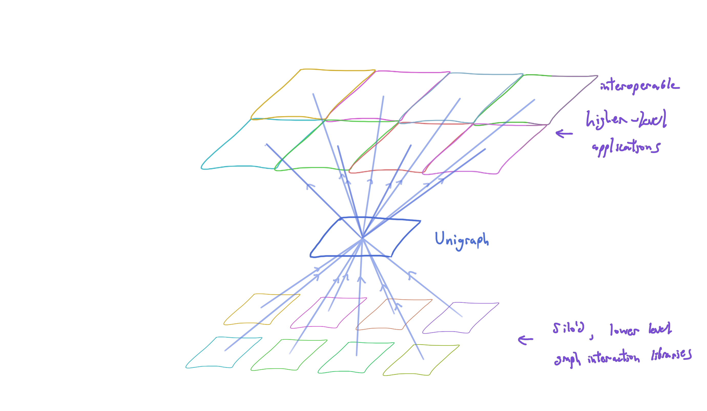

## Unigraph: the near-term vision

Unigraph aims to be an adaptor between web-based client-side interactive graph-based applications.

Some popular existing interactive graph based libraries and tools are:

* Graphviz
* ReactFlow
* ForceGraph3d
* MermaidJS
* Gephi
* Cytoscape
* SigmaJS

Unigraph is not replacing, but absorbing and extending existing solutions so that they are interoperable.
Unigraph is a single technology to build higher level applications that are interoperable.

Some examples of higher level applications are in the domains of:

* System Design and Diagramming
* Knowledge Building and Collaboration
* Ontology and Semantic Technology Tools
* Data and Tool Discovery, Composition, and Chaining

Unigraph is a general solution for web-based client-side interaction with Graphs.
Unigraph aims to provide a field-theoretical framework for interoperable graph-based applications.

Unigraph is the first step towards Aesgraph.
