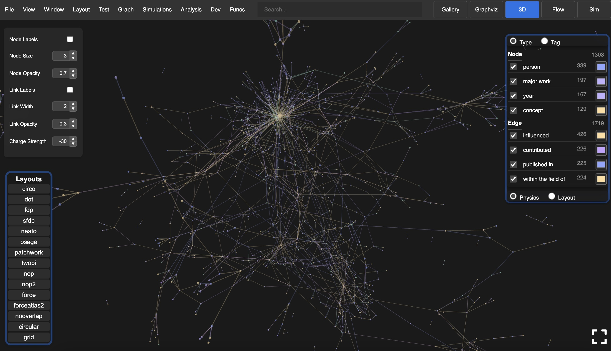
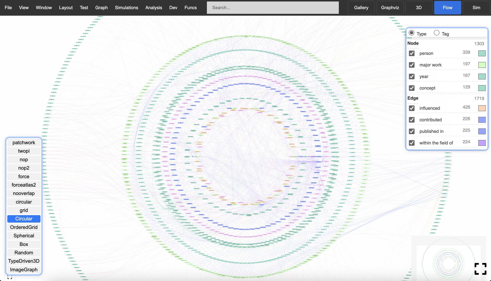

```mermaid
graph LR;
    TextDefinedGraph --> Graphviz
    Graphviz --> SVG
    TextDefinedGraph --> MermaidJS 
    MermaidJS --> SVG 
    SVG --> Unigraph 
    Unigraph --> UpdateNodePositions
    Unigraph --> ApplyNode/EdgeVisibilityFilters
    Unigraph --> AdjustNodeSizes
    ApplyNode/EdgeVisibilityFilters --> UnigraphModelGraph
    AdjustNodeSizes --> UnigraphModelGraph
    UpdateNodePositions --> UnigraphModelGraph
    InteractiveGraphManipulationIDE --> Unigraph
    UnigraphModelGraph --> Export
    Export --> |test|TextDefinedGraph


```

```mermaid
graph LR;
    MermaidJS-->Unigraph.app
    ReactFlow-->Unigraph.app
    ForceGraph3d-->Unigraph.app
    Graphviz-->Unigraph.app
    FileManagement-->Unigraph.app
    InformationRepresentationTheory-->Unigraph.app
    WebProduct-->Unigraph.app
    Unigraph.app-->ModellingAndDiagramming
    ModellingAndDiagramming-->UnigraphPlatform
    Unigraph.app-->KnowledgeExchange
    KnowledgeExchange-->UnigraphPlatform
    UserAdoptionInflux-->UnigraphPlatform
    UnigraphPlatform-->InformationRepresentationStandard
    UnigraphPlatform-->DataVisualizationIDE
    UnigraphPlatform-->ResearchAndCollaboration

    InformationRepresentationStandard-->Aesgraph
    DataVisualizationIDE-->Aesgraph
    ResearchAndCollaboration-->Aesgraph

    FieldTheoreticalFramework-->Aesgraph
    MassiveBackendComputation-->Aesgraph
    CrossOrganizationalDataPermissioning-->Aesgraph
    ZeroKnowledgeProofEngine-->Aesgraph

    
```

```mermaid
graph LR;
    MermaidJS-->Unigraph.app
    ReactFlow-->Unigraph.app
    ForceGraph3d-->Unigraph.app
    Graphviz-->Unigraph.app
    FileManagement-->Unigraph.app
    InformationRepresentationTheory-->Unigraph.app
    WebProduct-->Unigraph.app
    Unigraph.app-->UnigraphPlatform
    UnigraphPlatform-->ModellingAndDiagramming
    UnigraphPlatform-->InformationRepresentationStandard
    UnigraphPlatform-->DataVisualizationIDE
    UnigraphPlatform-->KnowledgeExchange
    UnigraphPlatform-->ResearchAndCollaboration

    ModellingAndDiagramming-->Aesgraph
    InformationRepresentationStandard-->Aesgraph
    DataVisualizationIDE-->Aesgraph
    KnowledgeExchange-->Aesgraph
    ResearchAndCollaboration-->Aesgraph

    FieldTheoreticalFramework-->Aesgraph
    MassiveBackendComputation-->Aesgraph
    CrossOrganizationalDataPermissioning-->Aesgraph
    ZeroKnowledgeProofEngine-->Aesgraph

    
```

```mermaid
graph LR;
    MermaidJS-->Unigraph
    ReactFlow-->Unigraph
    ForceGraph3d-->Unigraph
    Graphviz-->Unigraph
    FileManagement-->Unigraph
    InformationRepresentationTheory-->Unigraph
    WebProduct-->Unigraph
    Unigraph-->SystemsDiagrammingApp
    Unigraph-->GraphModellingEcosystem
    Unigraph-->InformationRepresentationStandard
    Unigraph-->DataVisualizationIDE
    Unigraph-->KnowledgeExchangePlatform

    SystemsDiagrammingApp-->Aesgraph
    GraphModellingEcosystem-->Aesgraph
    InformationRepresentationStandard-->Aesgraph
    DataVisualizationIDE-->Aesgraph
    KnowledgeExchangePlatform-->Aesgraph

    FieldTheoreticalFramework-->Aesgraph
    MassiveBackendComputation-->Aesgraph
    CrossOrganizationalDataPermissioning-->Aesgraph
    ZeroKnowledgeProofEngine-->Aesgraph
    
```

# Unigraph

**Unigraph is a human-centric graph model engine, application library, and information exchange platform.** **Unigraph is a general solution for web-based client-side interaction with Graphs.**

**Unigraph provides first-class mechanisms for managing display scenes independently from the underlying graph** **model, allowing for highly flexible and interactive representations of structured data.**

**Unigraph aims to provide a field-theoretical framework for graph-based applications and information exchange.** **Unigraph is both a developer library and a complete product.**

|  |  |

_OKRs_

- Unigraph has the largest and most complete feature set of any web-based graph interaction product. [Unigraph FeatureSet Document](https://quip.com/v1egAJMobayS)
- Unigraph provides programmatic and no-code environments for fully-featured graph construction, inspection, visualization, filtering, layouting, analysis, file management and sharing.
- Unigraph offers a formal language, framework, and standard for graph-based information representation and analysis.

_Documents_

- [Unigraph: the near-term vision](https://quip.com/QfEYAqajUUvK)
- [Unigraph: the long-term vision](https://quip.com/MuEmAGbxn5FO)
- [Unigraph Milestones](https://quip.com/SCh0AuqIClES)
- [Unigraph v0 Design Decisions](https://quip.com/Rg3uAGEyLxQb)

_Restatements of its aims:_

- Unigraph aims to be an intermediate representation language and protocol that can connect independently developed graph-based libraries and applications, and compose higher-level applications and products.
- Unigraph centralizes existing graph-based technologies into a single unified product for working with spatial and structured information.

_Focuses:_

- [Unigraph and Composability](https://quip.com/acTWAFYXfnUo)
- Unigraph is good for navigating human-centric information that is high dimensional and has high connection density.
- Unigraph is a complete product in itself, is entirely web-based, and does all processing client-side.

_Benefits of this product that sets it apart from others:_ 

- Graph model construction and sharing platform that is immediately accessible to anyone
- Graph model consistency and validity check machine 
- Graph format converter and data enhancement tool

_Motivation:_ 

Model construction and representation is a hard thing to do. It is a critical way by which information is communicated, but there is no standard for it. Unigraph aims to centralize development effort around this, and offer a standard tool for graph-based information representation and sharing. 

_Specific offerings:_ 

Unigraph provides first class workflows for creating "scenes" of complex high dimensional data so that they are more interpretable. It achieves this by offering robust management of layouts, filters, and graph rendering options that can be interchanged on the same underlying graph model. Furthermore, Unigraph emphasizes composability so that various users may combine graphs and scenes that were independently developed, and downsample into more manageable projections.

**Unigraph is the first step towards [Aesgraph](https://quip.com/W58VAJDPGbUb).**

