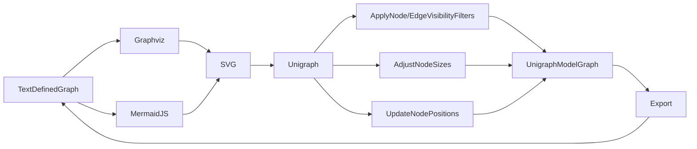

## Getting Started with Unigraph

There are several ways Unigraph can be used immediately.

The first focus of Unigraph is to offer enhanced inspection and interaction tools for Graphs.
Unigraph is a central application that allows importing, editing, and exporting of Graphs between various other Graph-based tool formats.

